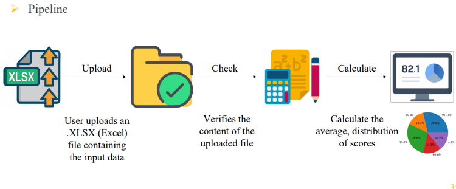
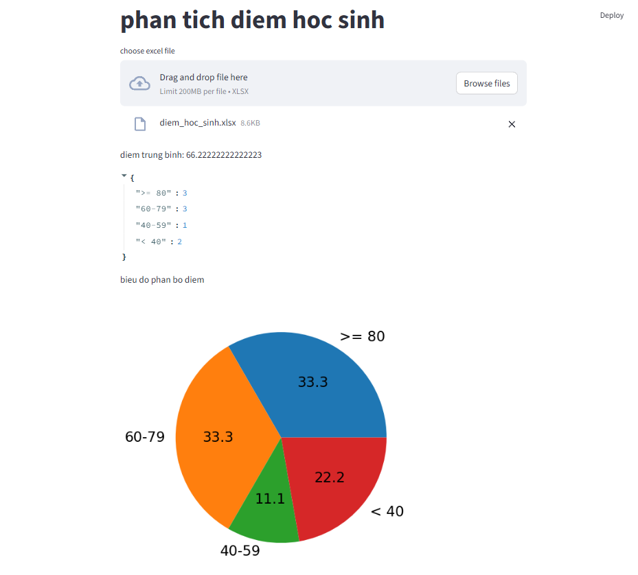
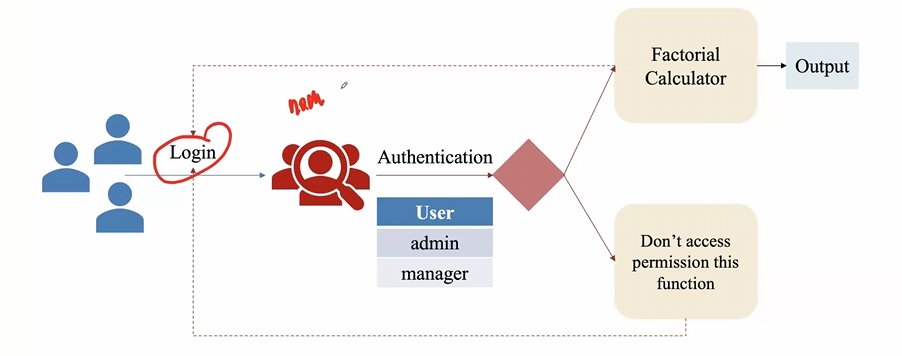
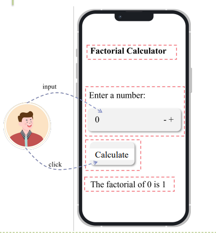

# Streamlit trong 5 phút - Hướng dẫn từ cơ bản đến ứng dụng thực tế

## 📝 Giới thiệu

Đây là một dự án hướng dẫn học Streamlit từ cơ bản đến nâng cao trong vòng 5 phút. Dự án bao gồm 3 ứng dụng web được xây dựng bằng Streamlit, từ việc làm quen với các thành phần cơ bản đến những ứng dụng thực tế có tính năng phân tích dữ liệu và xác thực người dùng.

**Điểm đặc biệt**: Tất cả các ứng dụng được tạo ra từ một file Jupyter Notebook duy nhất (`main.ipynb`) sử dụng lệnh `%%writefile` - một cách tiếp cận rất hay để phát triển và tổ chức code!

## 🗂️ Cấu trúc dự án

```
streamlit-in-5-mins/
├── README.md
├── basic_web_deploy_streamlib/
│   ├── main.ipynb          # File chính - Jupyter Notebook
│   ├── app.py              # App 1: Tutorial cơ bản
│   ├── app2.py             # App 2: Phân tích điểm học sinh  
│   ├── app3.py             # App 3: Calculator với authentication
│   ├── assets/             # Thư mục chứa hình ảnh và media
│   └── data/               # Thư mục chứa dữ liệu mẫu
```

## 🎯 Mục tiêu chính của `main.ipynb`

File `main.ipynb` là trái tim của dự án này, được thiết kế với 3 mục đích chính:

### 1️⃣ **Tutorial cơ bản Streamlit** 
Mô tả đầy đủ các hàm cơ bản của Streamlit với comment chi tiết. Bạn hãy thử từng đoạn code với chức năng khác nhau và sẽ thấy sự thay đổi từng bước của trang web.

### 2️⃣ **Ứng dụng phân tích dữ liệu thực tế**
Một trang web đơn giản để phân tích và visualize phân bố điểm của học sinh.

### 3️⃣ **Ứng dụng với xác thực người dùng** 
Một trang web có user authentication để phân quyền người dùng và chức năng tính giai thừa đơn giản.

---

## 🚀 I. Tutorial cơ bản Streamlit (app.py)

### Mô tả
App đầu tiên này giới thiệu tất cả các thành phần cơ bản của Streamlit:
- Hiển thị text (title, header, subheader, caption)
- Markdown và LaTeX
- Hiển thị media (hình ảnh, âm thanh, video)
- Các widget input (checkbox, radio, selectbox, slider)
- Biểu đồ cơ bản

### Chạy ứng dụng
```bash
streamlit run app.py
```

### Tính năng chính
- 📝 Hiển thị text với nhiều định dạng khác nhau
- 🎨 Hỗ trợ Markdown và công thức toán học
- 🖼️ Hiển thị media (ảnh, âm thanh, video)
- 🎛️ Các widget tương tác (checkbox, radio, slider, input)
- 📊 Biểu đồ dữ liệu cơ bản

---

## 📊 II. Phân tích điểm học sinh (app2.py)



### Mô tả
Ứng dụng web để phân tích và visualize phân bố điểm số của học sinh từ file Excel.



### Chạy ứng dụng
```bash
streamlit run app2.py
```

### Tính năng
- 📁 Upload file Excel chứa dữ liệu điểm
- 📈 Tính điểm trung bình
- 📊 Phân tích phân bố điểm theo các khoảng:
  - ≥ 80: Giỏi
  - 60-79: Khá  
  - 40-59: Trung bình
  - < 40: Yếu
- 🥧 Hiển thị biểu đồ tròn phân bố điểm

### Dữ liệu mẫu
Sử dụng file `data/diem_hoc_sinh.xlsx` để test ứng dụng.

---

## 🔐 III. Calculator với Authentication (app3.py)



### Mô tả
Ứng dụng tính giai thừa với hệ thống xác thực người dùng đơn giản.



### Chạy ứng dụng
```bash
streamlit run app3.py
```

### Tính năng
- 🔐 **Hệ thống đăng nhập**: Chỉ user có quyền mới được truy cập
- 🧮 **Tính giai thừa**: Tính giai thừa của số từ 0-50
- 💾 **Cache**: Sử dụng `@st.cache_data` để tối ưu performance  
- 👤 **Session State**: Quản lý trạng thái đăng nhập
- 🚪 **Đăng xuất**: Tính năng logout an toàn

### Tài khoản test
- Username: `admin` hoặc `manager`
- Không cần password (demo đơn giản)

---

## 🛠️ Cài đặt và chạy

### Yêu cầu hệ thống
- Python 3.7+
- Streamlit
- Pandas
- Matplotlib
- Pillow

### Cài đặt
```bash
# Clone repository
git clone <repository-url>
cd streamlit-in-5-mins

# Cài đặt dependencies
pip install streamlit pandas matplotlib pillow openpyxl

# Chạy Jupyter Notebook (tùy chọn)
jupyter notebook basic_web_deploy_streamlib/main.ipynb
```

### Chạy từng ứng dụng
```bash
cd basic_web_deploy_streamlib

# App 1: Tutorial cơ bản
streamlit run app.py

# App 2: Phân tích điểm
streamlit run app2.py  

# App 3: Calculator với auth
streamlit run app3.py
```

## 💡 Điểm đặc biệt - Sử dụng `%%writefile`

Một điểm hay trong dự án này là việc sử dụng lệnh `%%writefile` trong Jupyter Notebook để tạo ra các file Python:

```python
%%writefile app.py
import streamlit as st
# Nội dung ứng dụng...
```

Cách tiếp cận này giúp:
- ✅ Tổ chức code một cách khoa học
- ✅ Dễ dàng thực nghiệm và chỉnh sửa
- ✅ Có thể chạy và test ngay trong notebook
- ✅ Tạo ra các file độc lập cho deployment

## 🎓 Kết luận

Dự án này cung cấp một lộ trình học tập Streamlit hoàn chỉnh từ cơ bản đến nâng cao. Bạn sẽ học được:

1. **Các thành phần cơ bản** của Streamlit UI
2. **Xây dựng ứng dụng thực tế** với data processing và visualization  
3. **Quản lý state và authentication** cho ứng dụng web

Hãy thử từng ứng dụng và cảm nhận sự mạnh mẽ của Streamlit trong việc tạo ra web apps chỉ bằng Python! 🐍✨

---

## 📞 Liên hệ

Nếu bạn có thắc mắc hoặc muốn đóng góp cho dự án, hãy tạo issue hoặc pull request.

**Happy Coding!** 🚀